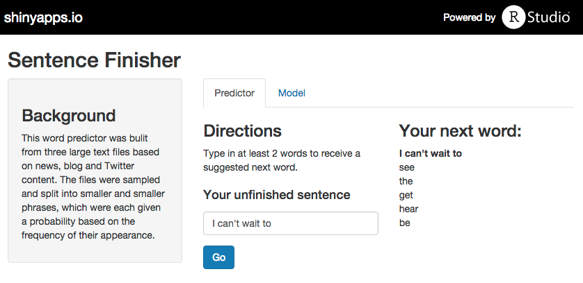

Simple Text Predictor
========================================================
author: kwalker
date: 8.20.15

Text prediction
========================================================

Mobile usage and communication has become increasingly normal. Along with that comes the desire for faster and more intuitive ways to send messages.   

To satisfy this need, we developed a simple text prediction app that takes a string of words and suggests 5 next words to the user.  

We will cover:  
* Data source + pre-processing  
* Building the model  
* The application

Data source + preprocessing
========================================================

- A **3% sample** of a large corpora of text files, sourced from news, blogs and Twitter, was used to build the model.  
- **Preprocessing** included transforming into lowercase, removing numbers and punctuation, and stripping whitespace.  
- We have intentionally left in **stopwords** ("a", "an", "the") and profanity to ensure a more natural-sounding prediction.  
- Using the tm package, the text was tokenized and formed into four n-gram term document matrices (1-, 2-, 3- and 4-grams) and then **compressed** to cover 90% of all tokens.  

The model
========================================================
- The user's tokenized **input** is used to match potential phrases in each n-gram corpus   
- Each match's **probability** is calculated based on how often it appears in relation to how often the input string appears
- Their probabilities are smoothed using **Kneser-Ney smoothing** to help account for phrases not found in the corpora
- The model then chooses the five most likely answers based on how probable those words are to occur together   

The app
========================================================
The user inputs a string of words and is served five options for their next word choice. A secondary tab explains the model. Use the app here: [https://walkerkq.shinyapps.io/DS_Cap]("https://walkerkq.shinyapps.io/DS_Cap").   

